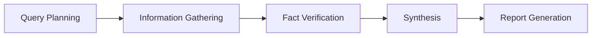

# Research Agent Module

## Quick Start

```typescript
import { ResearchAgent } from './index';
import { Memory } from '../../../schema';
import { LLM } from '../../llm';

const agent = new ResearchAgent({
  name: "researcher",
  llm: LLM.getInstance("default"),
  memory: new Memory()
});

const report = await agent.run("What are the latest trends in AI safety?");
```

## Components

### Core Agent
- `research_agent.ts` - Main research agent implementation
- `types.ts` - TypeScript types and schemas
- `report_generator.ts` - Report formatting and generation

### Research Tools
Located in `/app/tool/research/`:
- `web_search.ts` - Web search capabilities
- `web_scraper.ts` - Content extraction
- `fact_verifier.ts` - Fact checking and verification
- `document_analyzer.ts` - Document analysis and summarization

### Prompts
Located in `/app/prompt/research/`:
- `prompts.ts` - Specialized prompts for each research stage

## Research Pipeline



## Key Features

1. **Structured Research Process**
   - Systematic approach to information gathering
   - Multi-stage verification
   - Evidence-based conclusions

2. **Source Management**
   - Credibility assessment
   - Citation tracking
   - Cross-referencing

3. **Flexible Output**
   - Markdown for readability
   - JSON for data processing
   - HTML for web display

## API Reference

### ResearchAgent

```typescript
class ResearchAgent extends ToolCallAgent {
  async run(query: string): Promise<string>
  getJSONReport(): string | null
  getHTMLReport(): string | null
}
```

### Research Types

```typescript
interface ResearchReport {
  title: string
  executive_summary: string
  query: ResearchQuery
  findings: ResearchFinding[]
  methodology: string
  limitations: string[]
  recommendations?: string[]
  citations: Citation[]
  generated_at: string
}
```

## Configuration

### Depth Levels
- `shallow`: Quick overview (5-10 sources)
- `medium`: Standard research (10-20 sources)
- `deep`: Comprehensive analysis (20+ sources)

### Customization Options
- Custom prompts for domain-specific research
- Additional tools for specialized sources
- Configurable verification thresholds

## Examples

See `/example/research_agent_demo.ts` for complete examples.

## Testing

```bash
# Run the demo
npx tsx example/research_agent_demo.ts

# Run with custom query
RESEARCH_QUERY="Your query here" npx tsx example/research_agent_demo.ts
```